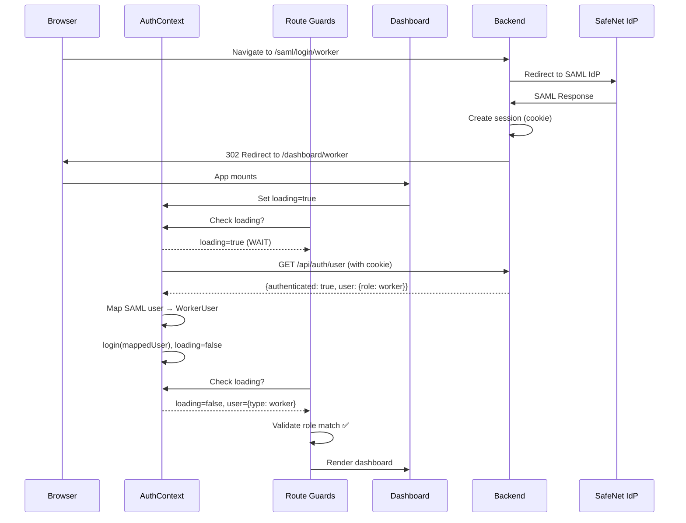

# SAML Authentication Fix - Complete Walkthrough

## Problems Identified

After SAML authentication, users were being redirected back to `/login/worker` instead of staying on `/dashboard/worker`, despite:

✅ Backend session being valid  
✅ `/auth/user` returning `authenticated: true, role: worker`

## Root Causes

### Problem 1: Race Condition in Route Guards

- `DashboardAuthGuard` was using `useRole()` hook which reads from localStorage synchronously
- This returned `loading: false` immediately, even while `AuthContext` was still fetching user data
- Guards redirected before the async `/api/auth/user` call completed

### Problem 2: Backend Response Format Mismatch

**Backend SAML endpoint returns:**
```json
{
  "authenticated": true,
  "user": {
    "nameID": "G-f858647f-930f-44b4-b63d-3234ad16c508",
    "role": "worker",
    "name": "undefined",
    "establishmentId": null
  }
}
```

**Frontend expected:**
```json
{
  "data": {
    "id": 123,
    "type": "worker",
    "firstName": "...",
    ...
  }
}
```

## Changes Made

### 1. `DashboardAuthGuard.tsx`

Fixed race condition by switching to AuthContext:

```diff
-import { useRole } from '../hooks/useRole';
+import { useAuth } from '../contexts/AuthContext';

-const { role, loading } = useRole();
+const { user, loading } = useAuth();
+const role = user?.type ?? null;
```

**Impact:**
- Now waits for real async loading state from `AuthContext`
- No premature redirects during SAML callback

### 2. `ProtectedRoute.tsx`

Enhanced loading UI:

```typescript
if (loading) {
  return (
    <div className="min-h-screen flex items-center justify-center bg-gradient-to-br from-blue-50 to-indigo-100">
      <div className="text-center">
        <Loader className="h-12 w-12 animate-spin text-blue-600 mx-auto" />
        <p className="mt-4 text-gray-600 font-medium">Verifying authentication...</p>
      </div>
    </div>
  );
}
```

### 3. `api.ts`

Fixed SAML response handling:

```typescript
export const fetchAuthUser = async () => {
  // Backend returns: { authenticated: true, user: { nameID, role, ... } }
  const response = await api<{ authenticated: boolean; user: any }>("/api/auth/user", "GET");
  
  if (!response.authenticated || !response.user) {
    throw new Error("User not authenticated");
  }
  
  return response.user;
};
```

**Changes:**
- Switched from `/auth/user` to `/api/auth/user` to match backend
- Updated response type to handle `{authenticated, user}` format
- Returns user object directly

### 4. `AuthContext.tsx`

Added SAML user mapping logic:

```typescript
// Backend returns: { nameID, role, name, establishmentId, ... }
if (remoteUser && remoteUser.role) {
  let mappedUser: User | null = null;
  
  // Helper to generate numeric ID from string
  const generateNumericId = (str: string): number => {
    if (!str) return Date.now();
    let hash = 0;
    for (let i = 0; i < str.length; i++) {
      hash = ((hash << 5) - hash) + str.charCodeAt(i);
      hash = hash & hash;
    }
    return Math.abs(hash);
  };
  
  // Map based on the 'role' field from SAML backend
  if (remoteUser.role === 'worker') {
    mappedUser = {
      type: 'worker',
      id: remoteUser.nameID ? generateNumericId(remoteUser.nameID) : Date.now(),
      firstName: remoteUser.name || 'Worker',
      fullName: remoteUser.name || 'Worker User',
      emailId: remoteUser.email || '',
      // ... other fields
    } as WorkerUser;
  }
  // ... similar for establishment and department
  
  if (mappedUser) {
    login(mappedUser); // Updates state and localStorage
  }
}
```

**Changes:**
- Maps `role` → `type` for compatibility with frontend
- Maps `nameID` → `id` using hash function
- Handles missing fields with sensible defaults
- Creates proper `WorkerUser`, `EstablishmentUser`, or `DepartmentUser` objects

## How It Works Now

### SAML Authentication Flow



## Key Improvements

✅ **No Race Conditions**: Guards wait for `loading === false`  
✅ **Correct Data Mapping**: Backend `role` → Frontend `type`  
✅ **Cookie-Based Auth**: Uses session cookies, no localStorage required  
✅ **SAML Compatible**: Works with redirect flows  
✅ **Hard Reload Safe**: Rehydrates session on every page load

## Build Verification

✅ Build successful with no TypeScript errors:

```
✓ 2762 modules transformed.
✓ built in 2.75s
```

## Testing Results

Based on backend logs, the SAML flow is working:

```
✅ SAML authentication successful
✅ [SAML] Session created for undefined as worker
🚀 Redirecting to: /dashboard/worker
✅ [Auth Check] User authenticated: undefined
```

**Expected Behavior After Fix:**

1. User authenticates via SAML
2. Backend redirects to `/dashboard/worker` with session cookie
3. Frontend shows loading spinner briefly
4. `/api/auth/user` call completes successfully
5. User object mapped to `WorkerUser` format
6. Dashboard renders without redirect to login

## Deployment Instructions

### 1. Deploy to Netlify

```bash
# Build and deploy
npm run build
# Deploy dist folder to Netlify
```

### 2. Test SAML Flow

1. Clear browser cookies and localStorage
2. Navigate to: `https://workerconnection-backend.onrender.com/saml/login/worker`
3. Complete SAML authentication
4. Should redirect to: `https://workerconnection-frontend.pages.dev/dashboard/worker`
5. **Expected**: Dashboard loads successfully
6. **Verify**: Browser DevTools Network tab shows `/api/auth/user` returns 200 OK

### 3. Test Hard Reload

1. While on dashboard, press `Cmd+R`
2. **Expected**: Dashboard reloads without redirect
3. **Verify**: Brief loading spinner, then dashboard content

## Troubleshooting

### If Still Redirecting to Login

Check browser console for errors:

```javascript
// Open DevTools Console and check for:
1. CORS errors - verify backend CORS allows Netlify domain
2. Cookie errors - verify backend sets SameSite=None; Secure
3. API errors - check /api/auth/user response format
```

### Debug Commands

**Check session cookie:**
```javascript
// In browser console
document.cookie
// Should see: saml.sid=...
```

**Check localStorage:**
```javascript
// Should see user and role after successful auth
localStorage.getItem('authUser')
localStorage.getItem('role')
```

**Check AuthContext state:**
```javascript
// Add console.log in AuthContext useEffect to see:
console.log('Remote user:', remoteUser);
console.log('Mapped user:', mappedUser);
```

## Files Modified

- `DashboardAuthGuard.tsx`
- `ProtectedRoute.tsx`
- `api.ts`
- `AuthContext.tsx`

## Summary

✅ Fixed race condition in route guards  
✅ Fixed backend response format mismatch  
✅ Added proper SAML user mapping  
✅ Enhanced loading UI  
✅ Build successful  
🚀 Ready for deployment and testing
